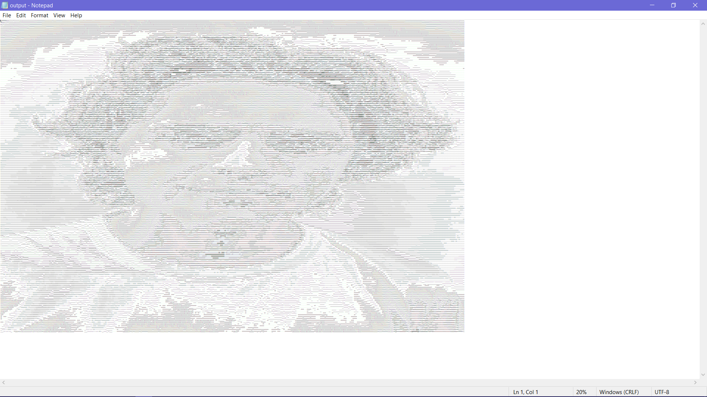

# ImageToAscii
Turn Images into ASCII-art

## Requirements
- Python 3
- Pip (Python's Package Manager)

## Installation
- First, clone the repository.
```
git clone https://github.com/daspartho/ImageToAscii.git 
```
- Then, change your current directory into the ImageToAscii repository.
```
cd ImageToAscii
```
- Finally, install Pillow Library
```
pip install pillow
```

## Usage
Run the script from a terminal using
```
python main.py <image file path>
```

## Example

### image file


### output text file


Note: The text file produced may be quite large, to see the whole ASCII image try zooming out or reduce font size.

## Contributing
If you want to contribute code, just write a quick pull request and the developers will take a look at it.
If you want to suggest an idea, just write an issue and the developers will check it out!
